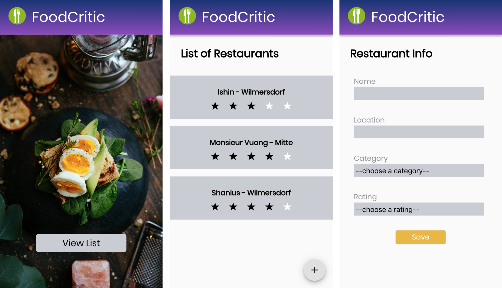

<p align="center"></p>

<h1 align="center">Food Critic App </h1>

## Overview

<p align="center"></p>


## Introduction
[ IN PROGRESS ]
- This project aims to create a restaurant review app.

## Stack

- This project uses: 
  - App: [React](https://reactjs.org/)
  - Styling: [Styled Components](https://www.styled-components.com/)

## Installation and Use

- Download the files, cd into root directory and run:
```bash
# Install dependencies
$ npm install

# Run the app
$ npm start
```

## References

- [MDN Web Docs](https://developer.mozilla.org/en-US/)
- [Styled Components](https://www.styled-components.com/)
- This project was bootstrapped with [Create React App](https://github.com/facebook/create-react-app).
- [React documentation](https://reactjs.org/).
